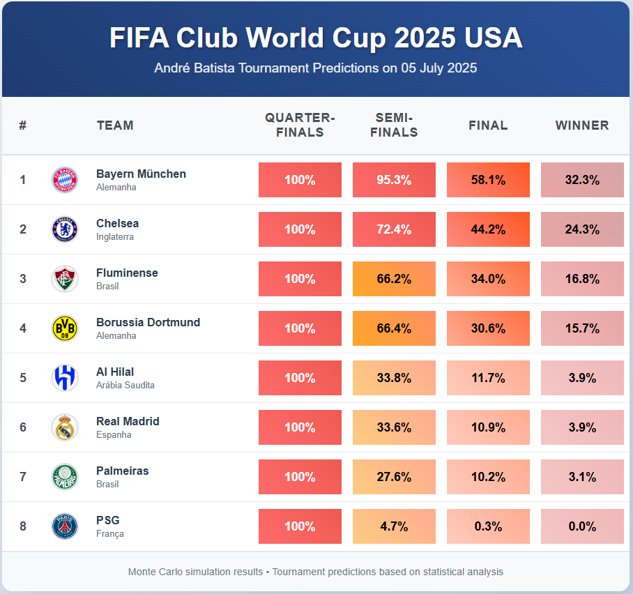
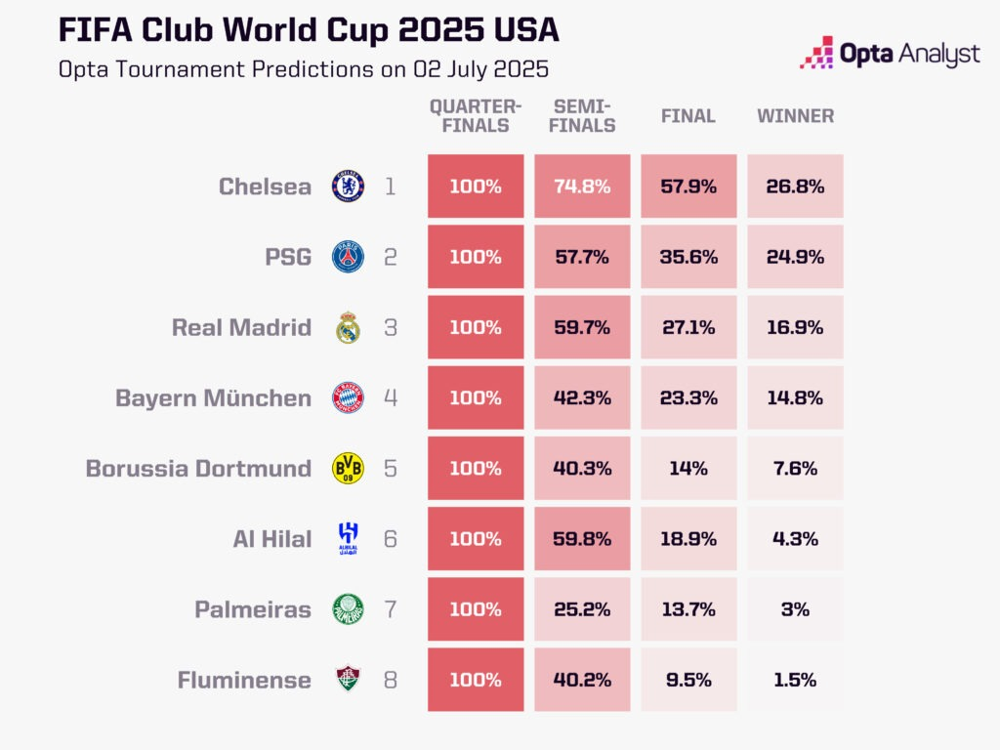

# FIFA Club World Cup 2025 - Monte Carlo Simulation


Uma aplicação completa para simulação e comparação de predições do **FIFA Club World Cup 2025** usando simulações de Monte Carlo com 10.000 iterações, comparando análises próprias com predições da plataforma **Opta Analytics**.

## 🏆 Visão Geral

Este projeto implementa um sistema completo de predição de torneios de futebol que:
- **Coleta dados históricos** de partidas do site FBREF
- **Calcula scores** dos times usando álgebra linear e mínimos quadrados
- **Executa 10.000 simulações** de Monte Carlo para predizer probabilidades
- **Compara resultados** com análises da Opta Analytics
- **Visualiza predições** em interface web interativa

## 🖼️ Comparação de Resultados

<div align="center">
  
  
</div>

*Comparação lado a lado: Simulação própria (esquerda) vs. Opta Analytics (direita)*

## 🛠️ Tecnologias Utilizadas

### Backend (Python)
- **Coleta de Dados**: Web scraping do FBREF
- **Análise Estatística**: NumPy, Pandas, SciPy
- **Álgebra Linear**: Solução de sistemas lineares por mínimos quadrados
- **Simulação**: Monte Carlo com 10.000 iterações

### Frontend (Web)
- **HTML5**: Estrutura semântica
- **CSS3**: Design responsivo com gradientes
- **JavaScript ES6**: Lógica de apresentação e interatividade
- **Visualização**: Tabelas comparativas com código de cores

## 📁 Estrutura do Projeto

```
cwc_simulations/
│
├── 📊 Scripts de Análise
│   ├── collect.py          # Coleta dados históricos do FBREF
│   ├── chance.py           # Cálculo de scores usando álgebra linear
│   ├── simulador.py        # Simulações de Monte Carlo
│   ├── main.py             # Script principal
│   └── requirements.txt    # Dependências Python
│
├── 🌐 Aplicação Web
│   ├── app/
│   │   ├── index.html      # Interface principal
│   │   ├── styles.css      # Estilos e design
│   │   ├── script.js       # Lógica frontend
│   │   └── escudos/        # Logos dos times
│   │       ├── Bayern.png
│   │       ├── Chelsea.png
│   │       └── ...
│
├── 📈 Dados e Resultados
│   └── data/
│       ├── resultados_monte_carlo.csv
│       ├── WORLD-CWC-scores.csv
│       └── ...
│
└── 🖼️ Comparações
    ├── _andre_predictions.png
    └── _opta_predictions.png
```

## 🚀 Como Executar

### 1. Configuração do Backend

```bash
# Clone o repositório
git clone https://github.com/andreluizfrancabatista/cwc_simulations.git
cd cwc_simulations

# Instale as dependências
pip install -r requirements.txt

# Execute a coleta de dados
python collect.py

# Calcule os scores dos times
python chance.py

# Execute as simulações
python simulador.py
```

### 2. Executar a Aplicação Web

```bash
# Navegue para a pasta da aplicação
cd app

# Abra um servidor local (Python)
python -m http.server 8000

# Ou use qualquer servidor web de sua preferência
# Acesse: http://localhost:8000
```

## 🔬 Metodologia

### Coleta de Dados (`collect.py`)
- **Fonte**: FBREF (Football Reference)
- **Dados**: Partidas históricas, estatísticas de times
- **Período**: Últimas temporadas relevantes

### Análise de Performance (`chance.py`)
- **Método**: Álgebra linear e estatística
- **Técnica**: Mínimos quadrados para sistemas lineares
- **Output**: Score numérico para cada time

### Simulação Monte Carlo (`simulador.py`)
- **Iterações**: 10.000 simulações
- **Método**: Probabilidades baseadas nos scores calculados
- **Resultado**: Percentuais de avanço em cada fase

## 🔍 Comparação

Os resultados foram comparados com as predições oficiais da **Opta Analytics**, plataforma reconhecida mundialmente por análises esportivas, para validar a precisão do modelo desenvolvido.

## 📄 Licença

Este projeto está licenciado sob a Licença MIT - veja o arquivo [LICENSE](LICENSE) para detalhes.

---
